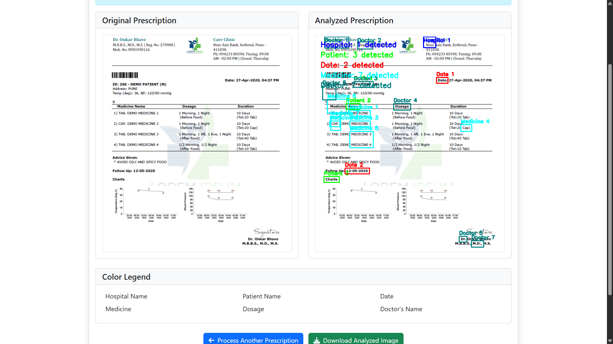

# 🧾 Prescription OCR Web App

This project is a Flask-based web application that allows users to upload prescription images and extracts key information such as hospital names, patient details, dates, medications, dosage instructions, and prescribing doctor using **OCR** with **Tesseract** and **OpenCV** preprocessing techniques.

---

## 🚀 Features

- Upload prescription images (JPG, PNG, JPEG).
- Image preprocessing to enhance OCR results.
- Detect and highlight elements such as:
  - Hospital/Clinic Name
  - Patient Name
  - Date (including DOB and prescription date)
  - Medicines and Dosages
  - Usage Instructions
  - Prescribing Doctor
- Draw bounding boxes around detected fields.
- Display extracted data for further use or download.

---

## 🛠 Tech Stack

- **Backend**: Python (Flask)
- **OCR**: Tesseract OCR (via `pytesseract`)
- **Image Processing**: OpenCV, PIL
- **Frontend**: HTML, CSS (Jinja templates)
- **Storage**: Uploaded and processed images stored in `/static`

---

## 📂 Project Structure

```
├── app.py
├── templates/
│   └── index.html
├── static/
│   ├── uploads/
│   └── processed/
├── README.md
```

---

## 🔧 Setup Instructions

### 1. Clone the repository

```bash
git clone https://github.com/tusharpamnani/prescription-ocr.git
cd prescription-ocr
```

### 2. Create a virtual environment (optional but recommended)

```bash
python -m venv venv
source venv/bin/activate  # On Windows: venv\Scripts\activate
```

### 3. Install dependencies

```bash
pip install -r requirements.txt
```

> **Note:** Create `requirements.txt` using:
> ```bash
> pip freeze > requirements.txt
> ```

### 4. Install Tesseract

- Download and install from: [https://github.com/tesseract-ocr/tesseract](https://github.com/tesseract-ocr/tesseract)
- Set the path in `app.py`:
```python
pytesseract.pytesseract.tesseract_cmd = r'C:\Program Files\Tesseract-OCR\tesseract.exe'
```

### 5. Run the Flask app

```bash
python app.py
```

App will be available at: [http://127.0.0.1:5000](http://127.0.0.1:5000)

---

## 📸 Screenshots



---

## 🙌 Acknowledgements

- [Tesseract OCR](https://github.com/tesseract-ocr/tesseract)
- [OpenCV](https://opencv.org/)
- [Flask](https://flask.palletsprojects.com/)
- Inspired by healthcare AI applications.

---
